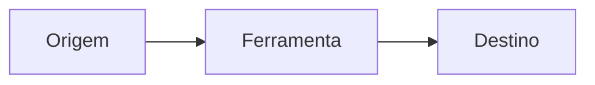

# {{title}}

## Resumo

## Conceitos-chave

## Caso de uso

## Fluxo de integração

## Exemplo prático

## Boas práticas

## Erros comuns

## Referências para aprofundar

## Veja também

```mermaid
flowchart LR
  A[Origem] --> B[Ferramenta] --> C[Destino]
```
